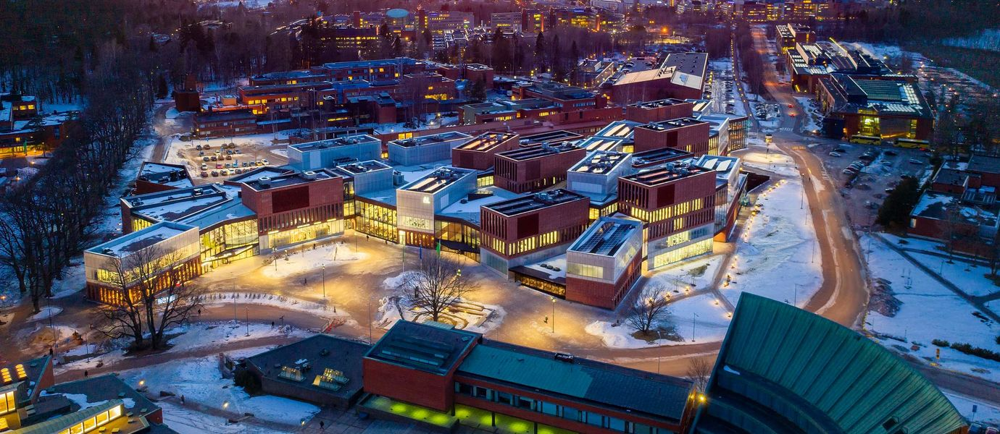

# 阿尔托大学	Aalto

> QS 综排：**TOP 127**	|	QS EE学科：**TOP 101+**	|	QS CS学科：**TOP 101+**
>
> CS Ranking (CV): Europe **TOP 49**	|	CS Ranking (CV): World **TOP 171**

## 申请要求 & 项目信息

按一般master项目来说：

### 申请要求

+ 接受托福，GRE
  + 托福最低分限制 （**92, and 22 for Writing** ）
  + 商学院需要GRE或者GMAT，工学院好像可以不用
+ 最多申请两个**study option**
+ 时间线
  + 2 December 2019 to 3 January 2020（去年网申开放时间）
  + No sooner than 30 March 2020 （去年网申结果公布时间）

### 项目信息

+ 时长：两年制
+ 需要写 MS thesis
+ 学费：€15 000 / y

## 项目选择

### **Msc Computer, Communication and Information Sciences** 

1. 很推荐
2. 有doctoral track，适合想继续学PhD的
3. 有好几个major，比较推荐的有：

   + Machine Learning, Data Science and Artificial Intelligence

   + Signal, Speech and Language Processing

     + 其中有两个方向，Signal Processing and Data Science和Speech and language processing
     + signal的方向可以学medical image或者 Pattern Recognition

## 其他参考

1. 可以考虑这几个CV方向的教授： [Assistant Professor Juho Kannala](https://users.aalto.fi/~kannalj1/) 和 [Assistant Professor Arno Solin](https://users.aalto.fi/~asolin/)