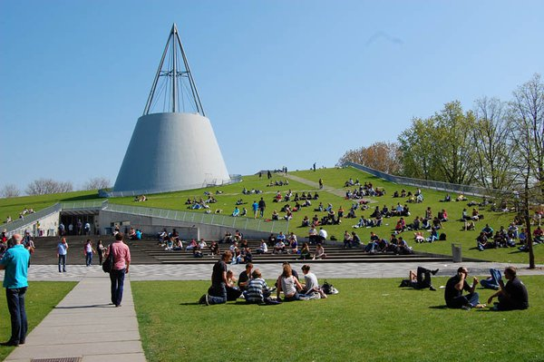

# 代尔夫特理工大学 TU Delft

> QS 综排：TOP 50	|	QS EE学科：TOP 16
>
> CS Ranking (CV): Europe TOP 35

## 申请要求 & 项目信息

按一般master项目来说：

### 申请要求

+ 接受托福，但有限制
  + 最低分限制 （A TOEFL iBT with an overall band score of at least 90 and a minimum score of 21 for each section. TU Delft does not accept TOEFL MyBest scores）
  + 托福也有两年时限（Certificates that are older than two years on the day you have uploaded the document and completed your application are not accepted.）
+ 本科学校限制
  + 211 or 双一流及以上（A bachelor's degree from either a First Class University from the Double First Class Initiative or a former Project 211 University. The final cumulative grade point average (CGPA) must be 80% or better.）差点惊呆了
+ *申请的时候可以抢跑
  + 官网上一般10.15左右开放申请，但10初可能就可以申了

### 项目信息

+ 时长：两年制
+ 第二年应该要写 MS thesis
+ 学费：€ 18.750 （官网上写的就是这个，是不是应该用逗号）

## 项目选择

### **Msc Computer Science** 

1. 很推荐
2. 有三个track： [ Data Science & Technology](https://www.tudelft.nl/en/education/programmes/masters/computer-science/msc-computer-science/the-data-science-technology-track/), [Software Technology](https://www.tudelft.nl/en/education/programmes/masters/computer-science/msc-computer-science/the-software-technology-track/) and [Artificial Intelligence Technology](https://www.tudelft.nl/en/education/programmes/masters/computer-science/msc-computer-science/the-artificial-intelligence-technology-track/). 可以选择data或者AI. 里面对应有research方向 the pattern recognition and bioinformatics

### **Msc Electrical Engineering**

1. 一般推荐
2. 课程方向有signals & systems track，比较偏重声音signal。看了一下课程，image课程也很少。如果想学image，建议加入子方向 biomedical signal processing

## 其他参考

1. 费用比较低；课程设置挺丰富，有个毕业设计项目，据说可以去有意向读博的教授组里做。
2. 欧洲读博那TU Delft完全ok，本身硕士项目设置比纯course-based要利于research