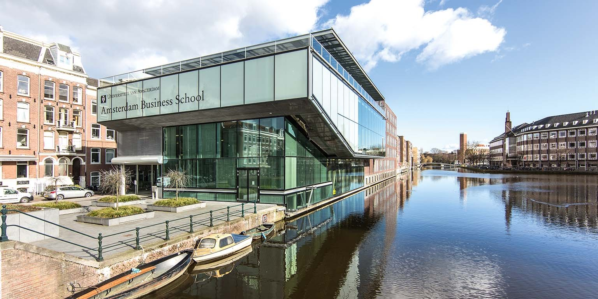

# 阿姆斯特丹大学	UvA

> QS 综排：**TOP 61**	|	QS CS学科：**TOP 45**
>
> CS Ranking (CV): **Europe TOP 14**	|	CS Ranking (CV): **World TOP 63**

## 申请要求 & 项目信息

具体来说：

### 申请要求

+ 起始**September**，DDL: **31 January** 23.59 CEST （如果申奖学金好像是别的时间）
+ 接受托福，但有限制
  + 常规项目：Internet-based test (iBT): 92 with a minimum subscore of 22 on each subject (listening/reading/writing/speaking)
  + 然后看到了AI的特别说明差点给我吓得魂掉了：Artificial Intelligence, Brain and Cognitive Sciences, Information Studies and Software Engineering: **100** with a minimum of **24** on each subject. 
  + 接受 ‘MyBest Scores’

### 项目信息

+ 时长：两年制
+ 第二年可以写 MS thesis
+ 学费：€15,510 / y

## 项目选择

### **MSc  Artificial Intelligence**

1. 强推
2. 可以选computer vision相关的课程
3. 第二年可以主要做research写thesis
4. 知乎上申请难度不小

### **Msc  Computer Science (joint degree UvA/VU)**

1. 不推荐
2. 课程方向有Big data
3. The curriculum in this Master’s programme mainly takes place at the VU Amsterdam，但是底下又说课程在两个学校都上
4. 在知乎上的回答：认识一个人在这边上的，他说回国认证是阿姆斯特丹自由大学，只是会说明在阿姆斯特丹大学学习过，所以感觉貌似略坑

### MSc Computational Science (joint degree UvA/VU)

1. 不怎么推荐
2. 课程方向主要是 Computational Finance/Economics 和 Computational Biology

## 其他参考

1. 找到了他们的 computer vision group，发了好几篇**CVPR** 2020，实力应该还是很强的
2. 其实阿大和自由大的联合项目有两个，一个是以阿大录取为基础的computational science，这个项目主要以数据分析为主，算力为主。而上面提到的VU+UVA的是以自由大录取要求为基础的computer science，这个项目更加综合，其中分支众多，有数据分析也有偏向编程要求的其他分支，所以不知道同学提到的是哪一个项目。前一个的录取应届生很难，后者VU基础的今年录很多，所以我比较支持这个。
3. 可以考虑这几个CV方向的教授：Grevers , Snoek, Geusebroek, Smeulders, Welling, Gavrila